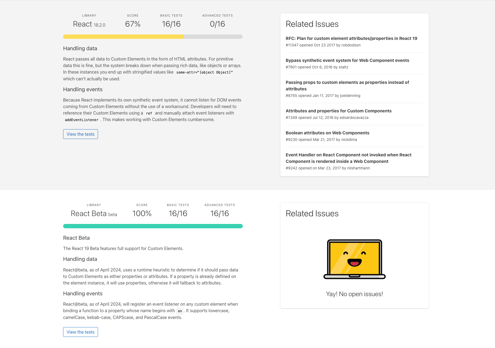
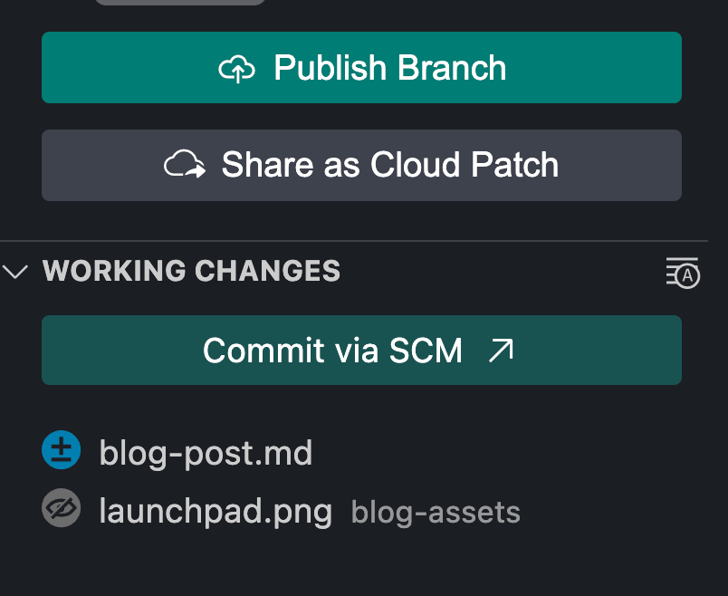
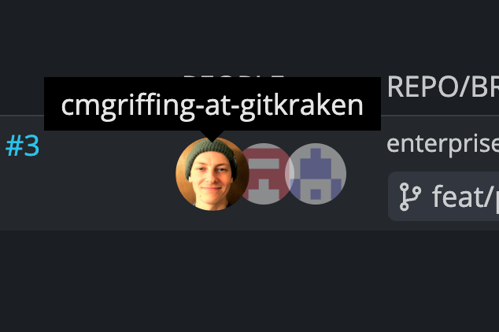
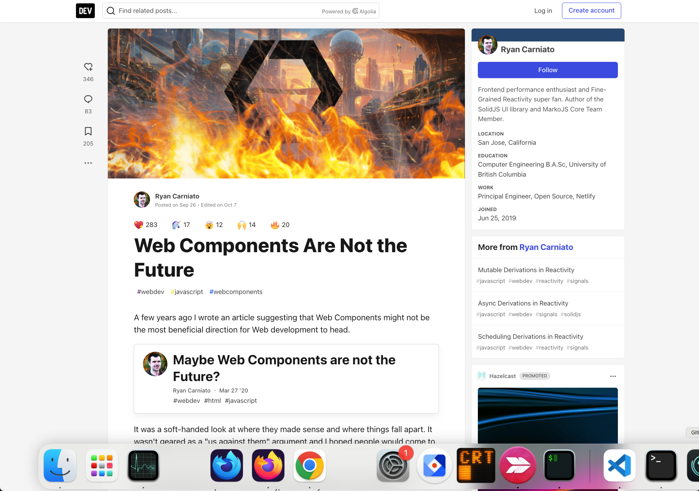
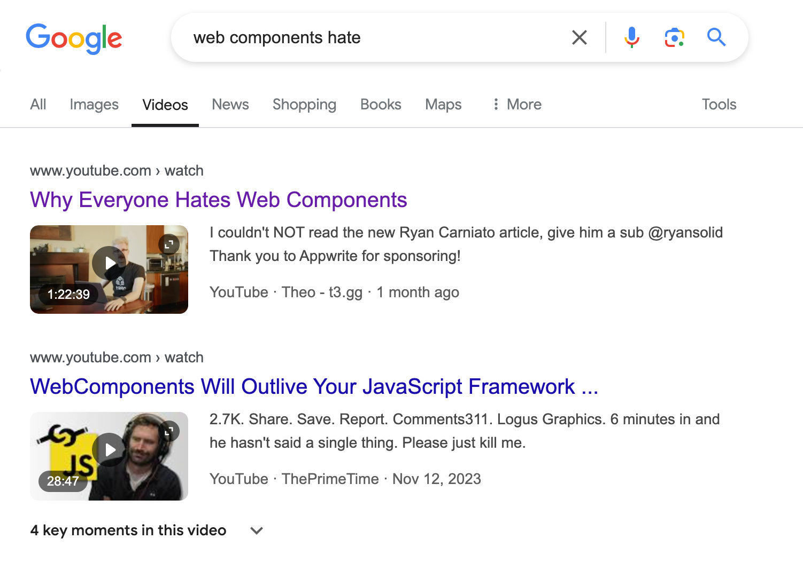

---
# You can also start simply with 'default'
theme: seriph
# random image from a curated Unsplash collection by Anthony
# like them? see https://unsplash.com/collections/94734566/slidev
background: ./images/xavi-cabrera-kn-UmDZQDjM-unsplash.jpg
# some information about your slides (markdown enabled)
title: "Cross-Framework Components: Using Custom Elements or Mitosis"
info: |
  ## Cross-Framework Components: Using Custom Elements or Mitosis

  A presentation about Web Components and Mitosis and how they can be used for cross-framework components
# apply unocss classes to the current slide
class: text-center
# https://sli.dev/features/drawing
drawings:
  persist: false
# slide transition: https://sli.dev/guide/animations.html#slide-transitions
transition: slide-left
# enable MDC Syntax: https://sli.dev/features/mdc
mdc: true
# take snapshot for each slide in the overview
overviewSnapshots: true
---

# Cross-Framework Components

Using Custom Elements or Mitosis (No, not cell division)

---
layout: image-right
image: ./images/self-portrait.jpg
---

# Introduction

- cmgriffing on all socials


- Software Dev for ~10 years
- Developer Advocate at GitKraken
- Twitch Programming Streamer
- Snowboarder

---
layout: image
image: ./images/gitkraken.png
---

#

---

# Why Cross-Framework Components

- Component Libraries
- Internal Design Systems

---
layout: cover
background: ./images/giammarco-boscaro-zeH-ljawHtg-unsplash.jpg
---

# History

---

# Components

IOS -> Sproutcore -> Ember -> etc

---

# A Different Source of Truth

DOM (jQuery) vs Component (Ember)

---

# Timeline

- **2011**: Web Components were introduced by Alex Russell at Fronteers Conference.

- **2013**: Polymer released by Google.

- **2016**: RequireJS was introduced as JavaScript library and AMD loader plugin

- **2017**: Ionic (mobile app framework) team built StencilJS

- **2018**: Angular 6 introduced Angular Elements

- **2018**: Firefox 63 enabled Web Components support by default

- **2018**: LitElement was developed by the Google Chrome team

---
layout: cover
background: ./images/marc-sendra-martorell--Vqn2WrfxTQ-unsplash.jpg
---

# Performance

https://krausest.github.io/js-framework-benchmark/current.html

---
layout: image
image: ./images/perf-duration-2.png
---

#

---
layout: image
image: ./images/perf-memory.png
---

#

---
layout: image
image: ./images/perf-transfer.png
---

#

---
layout: cover
background: ./images/adi-goldstein-9-PuIMFaCDw-unsplash.jpg
---

# Usage

---

# Basics

Just use the Browser's native APIs

- no required dependencies
- no required build tools
- no required runtime
- no required framework

---

# WebComponent APIs

- Custom Elements
- Shadow DOM
- HTML Templates

---

# Example

```js
class MyCustomElement extends HTMLElement {
  constructor() {
    super();
    this.attachShadow({ mode: "open" });
    this.shadowRoot.innerHTML = `
      <style>
        :host {
          display: block;
        }
      </style>
      <h1>Hello World</h1>
    `;
  }
}
customElements.define("my-custom-element", MyCustomElement);
```

```html
<my-custom-element />
```

---

# Lifecycle

```js
class MyCustomElement extends HTMLElement {
  constructor() {
    // Always call super first in constructor
    super();
  }

  connectedCallback() { console.log("Custom element added to page."); }

  disconnectedCallback() { console.log("Custom element removed from page."); }

  adoptedCallback() { console.log("Custom element moved to new page."); }

  attributeChangedCallback(name, oldValue, newValue) {
    console.log(`Attribute ${name} has changed.`);
  }
}
```

---

# Props (Data in)

```js
// Create a class for the element
class MyCustomElement extends HTMLElement {
  static observedAttributes = ["size"];

  constructor() {
    super();
  }

  attributeChangedCallback(name, oldValue, newValue) {
    console.log(
      `Attribute ${name} has changed from ${oldValue} to ${newValue}.`,
    );
  }
}
```

---
layout: two-cols-header
---

# Events (outbound)

```html
  <my-custom-element />
```

::left::

```js
  class MyCustomElement extends HTMLElement {
    constructor() {
      // Always call super first in constructor
      super();

      const button = document.createElement("button");
      button.addEventListener("click", () => {
        let event = new CustomEvent(
          "my-custom-element:clicked"
        );
        this.dispatchEvent(event);
      });
      button.innerText = "Click me!";
      this.append(button);
    }
  }
```

::right::

```js
document
  .querySelector("my-custom-element")
  .addEventListener(
    "my-custom-element:clicked",
    function () {
      alert("clicked");
    }
  );
```

---

# Framework Compatibility

https://custom-elements-everywhere.com/



---

# Gaps in Raw Web Components

- Packaging
- Lazy-loading
- Piercing the shadow DOM
- String templating vs DOM/JSX


---
layout: image-right
image: ./images/all-the-ways-2.png
---

# Other Ways

https://webcomponents.dev/blog/all-the-ways-to-make-a-web-component/

- HTMLElement
- Class
- Hook
- Object
- Compiler

---
layout: image-right
image: ./images/gk-views.png
---

# Using LitElement at GitKraken

<div class="mt-12">

Sharing between
- GitKraken Desktop
- GitLens in VSCode
- GitKraken.dev

</div>

---

# GitKraken Components

<div class="grid grid-cols-2 grid-rows-2 gap-4">




</div>

---

# Other Media

<div class="grid grid-cols-2 gap-4">


</div>

---

# Naysayers


<div class="grid grid-cols-2 gap-4">




</div>

---
layout: cover
background: ./images/mitosis-website.png
---

# Another Way with Mitosis

---
layout: fact
---

# Write components once, run everywhere.

---
layout: two-cols-header
---

# Targets

::left::

- Alpine
- Angular
- CustomElement
- HTML
- Liquid
- Lit
- Marko
- Preact
- Qwik
- React

::right::

- React Native
- RSC
- Solid
- Stencil
- Svelte
- Swift
- Taro
- Template
- Vue
- WebComponent

---

# Syntax

```js
import { useState } from "@builder.io/mitosis";

export default function MyComponent(props) {
  const [name, setName] = useState("Steve");

  return (
    <div>
      <input
        css={{
          color: "red",
        }}
        value={name}
        onChange={(event) => setName(event.target.value)}
      />
      Hello! I can run natively in React, Vue, Svelte, Qwik, and many more frameworks!
    </div>
  );
}
```

---
layout: two-cols-header
---

# Hooks

::left::

- useStore
- useState
- useContext
- useRef
- useStyle
- useDefaultProps
- useTarget

::right::

- onInit
- onMount
- onUnMount
- onUpdate

---

# Context

- created in their own file
- the file name must end with context.lite.ts
- the default export must be a function that returns a context object

---

# Context Definition

```js
// simple.context.lite.ts
import { createContext } from '@builder.io/mitosis';

export default createContext({
  foo: 'bar',
  get fooUpperCase() {
    return this.foo.toUpperCase();
  },
  someMethod() {
    return this.fooUpperCase.toLowercase();
  },
  content: null,
  context: {} as any,
  state: {},
});
```

---

# Context Usage

```js
import { setContext, useContext } from '@builder.io/mitosis';
import Context from './simple.context.lite';

export default function ComponentWithContext(props: { content: string }) {
  // you can access the context using `useContext`
  const foo = useContext(Context);

  // you can use `setContext` to provide a new value for the context
  setContext(Context, {
    foo: 'baz',
    content() {
      return props.content;
    },
  });

  return (
    // you can also use `Context.provider` to provide a new value for the context
    <Context.Provider value={{ bar: 'baz' }}>{foo.value}</Context.Provider>
  );
}
```

---

# Using JS Libraries

JS Libraries just work

```js
import { kebabCase } from 'lodash';

export default function MyComponent(props: { name: string }) {
  return <div>{kebabCase(props.name)}</div>;
}
```

---

# Using Framework-specific Libraries

Because of the cross-framework nature of Mitosis, you cannot use framework-specific libraries directly in Mitosis code.
